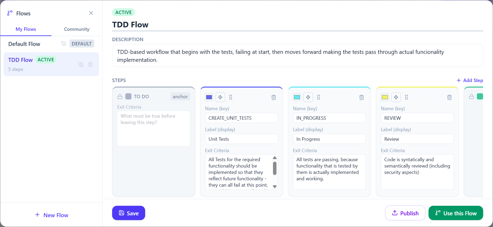
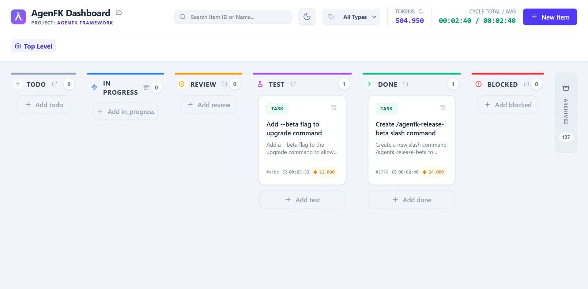

```text
                     ______           ______   _  __
     /\             |  ____|         |  ____| | |/ /
    /  \      __ _  | |__     _ __   | |__    | ' /
   / /\ \    / _` | |  __|   | '_ \  |  __|   |  <
  / ____ \  | (_| | | |____  | | | | | |      | . \
 /_/    \_\  \__, | |______| |_| |_| |_|      |_|\_\
              __/ |
             |___/
```

# AgEnFK: Agentic Engineering Framework

Welcome to **AgEnFK**, a high-reliability, measurable, and visual framework designed to turn "Vibe Coding" into rigorous **Agentic Engineering**. AgEnFK enforces a structured workflow that bridges the gap between autonomous AI agents and professional software engineering practices.

---

## Table of Contents

- [Overview](#overview)
- [How do I use AgEnFK?](#how-do-i-use-agenfk)
- [Supported Platforms](#supported-platforms)
- [Installation & Setup](#installation--setup)
  - [Post-Install Steps](#post-install-steps)
  - [Rules Scope — Global vs Project](#rules-scope--global-vs-project)
  - [Pausing & Resuming Integrations](#pausing--resuming-integrations)
  - [Uninstalling AgEnFK](#uninstalling-agenfk)
- [Multi-Project Support](#multi-project-support)
- [GitHub Issues Sync](#github-issues-sync)
- [Architecture Deep Dive](#architecture-deep-dive)
- [Custom Workflow Flows](#custom-workflow-flows)
- [Quick Start](#quick-start)
- [Operation Modes](#operation-modes)
- [Telemetry](#telemetry)
- [FAQ](#faq)

---

## Overview

AgEnFK is built on six core mandates to ensure your AI-assisted development is consistent and high-quality:

*   **Agile**: Uses Epics, Stories, Tasks, and Bugs as first-class workflow items.
*   **Measurable**: Automatically tracks input/output tokens and models used for every single unit of work.
*   **Visual**: A real-time, hierarchical Kanban board provides instant oversight of the entire project state.
*   **Repeatable**: Uses standardized tools, prompt protocols, and context engineering to make AI behavior deterministic.
*   **Reliable**: Enforces mandatory verification (build/lint/test) before any work is declared "Done".
*   **Flexible**: Plugin-based architecture with support for MCP (Model Context Protocol), usable across multiple AI coding agents.

## How do I use AgEnFK?

The core experience is simple: you describe what you want in plain language, and AgEnFK turns it into a structured, verified workflow. Here is what happens end-to-end using the default flow (TODO → IN_PROGRESS → REVIEW → TEST → DONE).

### 1. You make a request

Open your AI coding agent (Claude Code, Opencode, Gemini CLI, etc.) and type `/agenfk` followed by what you need:

```
/agenfk Add a retry mechanism to the API client with exponential backoff
```

The agent reads your request, classifies it (Task, Story, or Epic depending on complexity), and creates a card on the Kanban board in the **TODO** column.

### 2. The agent plans and codes

The agent advances the card to **IN_PROGRESS** and begins implementation. It explores your codebase, understands the context, writes the code, and logs progress comments on the card as it goes — giving you full visibility on the Kanban dashboard.

### 3. Build verification

Once the implementation is complete, the agent moves the card to **REVIEW** and performs a self-review of every file it modified. It then runs your project's build command (e.g. `npm run build`, `cargo build`) to verify the code compiles cleanly.

### 4. Test verification

The card advances to **TEST**, where AgEnFK runs your project's full test suite using the configured `verifyCommand`. If tests fail, the card is automatically moved back to IN_PROGRESS and the agent fixes the issues — no manual intervention needed.

### 5. Done

When all verification passes, the card moves to **DONE**, the agent commits the changes, and pushes the branch. You get a summary of everything that was implemented, and can choose to cut a release, start a new task, or keep iterating.

---

This default flow is the main workflow, but AgEnFK is designed to adapt to how **you** work — not the other way around.

**Define your own flows.** The default pipeline is just a starting point. You can create custom flows with any steps and exit criteria you need — for example, a BDD flow (TODO → WRITE_TESTS → IMPLEMENT → REVIEW → DONE) or a minimal flow (TODO → CODING → DONE). Share your flows with the community via the [AgEnFK Community Registry](https://github.com/cglab-public/agenfk-flows), and download flows published by other engineers — all from the Flow Editor in the Kanban UI. See [Custom Workflow Flows](#custom-workflow-flows) for details.

**Bring your own cards.** You don't have to start every task from a chat prompt. Import cards from **JIRA** or **GitHub Issues** to pull work items directly into your AgEnFK board (see [GitHub Issues Sync](#github-issues-sync)), or create and organise cards manually on the **Kanban dashboard** using drag-and-drop — then let the agent pick them up when you're ready.

## Supported Platforms

| Platform | Support Level | Enforcement | Notes |
|---|---|---|---|
| **Claude Code** | Fully Supported | PreToolUse hooks (mechanical) | Automatic blocking of workflow violations |
| **Opencode** | Fully Supported | MCP + skill integration | Native slash commands and skill system |
| **Google Gemini CLI** | Fully Supported | MCP + workflow rules | Native slash commands and skill system |
| **Cursor** | Experimental | Instructional (`.mdc` rules) | `alwaysApply: true` rule file |
| **OpenAI Codex CLI** | Fully Supported | MCP + skills | Skills invoked via `$agenfk` (type `$` in Codex to browse); `AGENTS.md` workflow rules |

> Cursor remains experimental because it relies on instructional rules without mechanical enforcement hooks. Codex CLI is fully supported via MCP integration; skills are accessed with `$skill-name` (not `/`).

## Installation & Setup

AgEnFK installs with a single command — no cloning required:

```bash
npx github:cglab-public/agenfk
```

This will:
*   Download the framework directly from GitHub.
*   Install all dependencies and build the full stack.
*   Configure the **MCP Server** for all detected AI coding agents (Claude Code, Opencode, Cursor, Codex CLI, Gemini CLI).
*   Install the **`/agenfk`** and **`/agenfk-release`** slash commands in your AI editors.
*   Install **workflow rules** into each platform (`CLAUDE.md`, `AGENTS.md`, `GEMINI.md`, `.mdc` for Cursor).
*   Install the **Agent Skill** into Opencode.
*   Symlink the **`agenfk`** CLI to `~/.local/bin` for global access.
*   Configure the **`start:services`** Node script to launch the API and Web UI.

> **Requirements**: Node.js 22.5+, git, and npm. To create GitHub releases, install the [gh CLI](https://cli.github.com/).

**To update**, run the same command again — npm will fetch the latest from GitHub and re-run setup.

### Post-Install Steps

After installation, complete the setup:

1.  **Restart your AI editor** (Opencode requires a restart to pick up the new MCP server).
2.  **Start the services** in a dedicated terminal — this keeps the API and Web UI running in the background:
    ```bash
    agenfk up
    ```
    This launches the API server on `http://localhost:3000` and the Kanban UI (typically `http://localhost:5173`).
3.  **Service Lifecycle**: Manage your installation with the following commands:
    *   `agenfk upgrade`: Fetch the latest release and auto-restart services.
    *   `agenfk upgrade --beta`: Opt-in to pre-release/beta versions.
    *   `agenfk restart`: Quickly cycle both the API and UI.
    *   `agenfk down`: Stop all running AgEnFK processes.
    *   `agenfk health`: Verify configuration, database, and connectivity.
    *   `agenfk integration list`: Show the supported editor and agent integrations.
    *   `agenfk pause <platform>`: Temporarily disable a specific integration (removes MCP config and skills). Use `all` to pause every integration.
    *   `agenfk resume <platform>`: Re-enable a previously paused integration. Use `all` to resume everything.
4.  **Initialize a project** — go to any repository and type `/agenfk` in your AI editor to link it to the framework.

### Rules Scope — Global vs Project

During first install, AgEnFK asks where workflow rules (`CLAUDE.md`, `AGENTS.md`, `GEMINI.md`, `agenfk.mdc`) should be installed:

*   **Global** (default) — rules go to `~/.claude/CLAUDE.md`, `~/.codex/AGENTS.md`, etc. They are picked up automatically by every AI coding tool, across all repositories — no per-repo setup needed.
*   **Project** — rules go to `.claude/CLAUDE.md`, `AGENTS.md` in the project root, etc. Scoped to the current repository only. You must install rules in each repo you want AgEnFK to manage.

Your choice is saved in `~/.agenfk/config.json` and respected on every upgrade. To manage rules after installation:

```bash
agenfk skills install            # install rules & skills globally (default)
agenfk skills install --project  # install into the current repo (uses git root)
agenfk skills uninstall          # remove global rules & skills (default)
agenfk skills uninstall --project  # remove project-scoped rules & skills
agenfk skills status             # show current scope (global, project, or none)
```

Switching automatically removes rules from the old location and installs them in the new one.

### Pausing & Resuming Integrations

You can temporarily disable one or all editor integrations without fully uninstalling AgEnFK. This is useful when you want to stop AgEnFK from appearing in a specific AI editor without losing your configuration or workflow data.

**Pause** removes the MCP server registration and all AgEnFK skills/slash commands from the target editor. The framework itself (server, database, CLI) continues running normally.

```bash
# Pause a single integration
agenfk pause claude
agenfk pause opencode
agenfk pause cursor
agenfk pause codex
agenfk pause gemini

# Pause all integrations at once
agenfk pause all

# Use --yes to skip the confirmation prompt
agenfk pause claude --yes
```

**Resume** re-installs the MCP registration and skills for the target editor, restoring it to fully operational state.

```bash
# Resume a single integration
agenfk resume claude
agenfk resume opencode

# Resume all previously paused integrations
agenfk resume all

# Use --yes to skip the confirmation prompt
agenfk resume all --yes
```

Paused integrations are tracked in `~/.agenfk/config.json` under `pausedIntegrations`. Resume respects your configured `rulesScope` (global or project) so rules are reinstalled in the correct location.

> **Supported platform IDs:** `claude`, `opencode`, `cursor`, `codex`, `gemini`. You can also use the alias `claude-code` for `claude`.

### Uninstalling AgEnFK

To fully remove AgEnFK from your system:

```bash
agenfk uninstall
```

This removes:
- All slash commands and skills from Claude Code, Opencode, and Gemini CLI
- MCP server configuration from all editors (Claude Code, Opencode, Cursor, Codex CLI, Gemini CLI)
- Cursor workflow rules (`agenfk.mdc`)
- Workflow rules from all scopes (`CLAUDE.md`, `AGENTS.md`, `GEMINI.md`)
- The AgEnFK PreToolUse hook from `~/.claude/settings.json`
- The `~/.agenfk-system` framework files
- The `agenfk` CLI symlink from `~/.local/bin`

Your project data (`~/.agenfk/db.sqlite`, `~/.agenfk/config.json`) is **not** deleted by default, so you can reinstall later without losing your boards and history.

**To uninstall only a specific editor integration** (leaving all others intact):

```bash
agenfk pause claude    # removes Claude Code MCP + skills only
agenfk pause cursor    # removes Cursor MCP + rules only
```

**To uninstall framework files only** (rules and skills, without removing the CLI or database):

```bash
agenfk skills uninstall          # remove global rules & skills
agenfk skills uninstall --project  # remove project-scoped rules & skills
```

## Multi-Project Support

AgEnFK supports managing multiple distinct projects from a single unified backend.

*   **Local Linking**: Each local repository is linked to a database project via a `.agenfk/project.json` file.
*   **Automatic Context Switching**: When an AI Agent (via MCP) or a developer (via CLI) starts working on a task, the API server automatically detects the project context and broadcasts an event via WebSockets.
*   **Reactive Dashboard**: The Web UI instantly and automatically switches its Kanban view to the active project being worked on, keeping the developer perfectly in sync with the agent's actions.
*   **Cross-Browser Drag & Drop**: Easily reorganize priorities with robust drag-and-drop card reordering that syncs instantly via WebSockets and optimistic UI updates.
*   **Deep Type Filtering**: Toggle view filters (e.g., "Stories Only") without losing your custom priority order across hidden items.

## GitHub Issues Sync

AgEnFK supports **bidirectional sync with GitHub Issues**, letting you share your Kanban cards as GitHub Issues and pull external issues back into your board.

### Prerequisites

*   [GitHub CLI (`gh`)](https://cli.github.com/) installed and authenticated (`gh auth login`).
*   A git remote pointing to a GitHub repository.

### Setup

From inside your project repository, run:

```bash
agenfk github setup
```

This auto-detects the `owner/repo` from your git remote and links it to the active AgEnFK project. The configuration is stored in `~/.agenfk/config.json`.

### Usage

#### CLI

| Command | Description |
|---|---|
| `agenfk github setup` | Link the current repo to AgEnFK for sync. |
| `agenfk github status` | Show current config, auth state, and last sync time. |
| `agenfk github sync` | Push and pull all items (default: both directions). |
| `agenfk github sync --push` | Push local items to GitHub Issues only. |
| `agenfk github sync --pull` | Pull GitHub Issues into AgEnFK only. |
| `agenfk github sync --item-id <id>` | Sync a single item by ID. |
| `agenfk github disconnect` | Remove the GitHub link for the current project. |

#### MCP Tool

AI agents can sync via the `github_sync` MCP tool:

```
github_sync(projectId, direction: "push" | "pull" | "both", itemId?)
```

#### Web UI

When GitHub sync is configured, the Kanban toolbar automatically shows:

*   **Issues** — Opens the GitHub Issues board in a new tab.
*   **Sync** — Triggers a full push + pull with a progress spinner and toast notification.
*   **Per-card links** — Cards linked to a GitHub Issue display a GitHub icon with the issue number (e.g., `#42`) that opens the issue directly.

### How It Works

*   **Outbound (Push)**: AgEnFK items are created/updated as GitHub Issues. Status maps to labels (`status:in-progress`, `status:done`, etc.) and open/closed state. Item type maps to labels (`type:bug`, `type:story`, etc.). Parent-child relationships render as markdown task lists.
*   **Inbound (Pull)**: GitHub Issues are matched by `externalId` or created as new AgEnFK items. Labels are reverse-mapped to AgEnFK statuses and types. Conflict detection uses timestamps — local wins when `updatedAt` is newer.
*   **Comments**: Synced bidirectionally with a `<!-- agenfk-sync -->` marker to prevent duplicates.

## Architecture Deep Dive

AgEnFK utilizes a **Single Owner Architecture** to ensure data consistency and real-time reactivity. This architecture prevents "split brain" scenarios where the AI agent and the human developer are looking at different states.

*   **API Server (The Owner)**: The heart of the framework. Built with Node.js and Express. It is the exclusive manager of the `db.json` storage. It actively watches the disk for changes and broadcasts real-time updates to all connected clients via **WebSockets**.
*   **MCP Server (The Bridge)**: A lightweight Model Context Protocol client. It exposes the AgEnFK tools (`create_item`, `validate_progress`, `workflow_gatekeeper`, etc.) to AI Agents. Instead of modifying the database directly, it forwards all tool invocations to the API Server via HTTP, ensuring all actions are logged and broadcasted.
*   **CLI (The Interface)**: A unified command-line tool (`./agenfk`) written in TypeScript. It allows both humans and agents to manage the backlog and framework state. Like the MCP server, it acts as a client to the API Server.
*   **Web Dashboard (The UI)**: A modern React/Vite application utilizing TanStack Query for state management. It provides a hierarchical Kanban board, token metrics, real-time progress logs (comments), detailed test results, and seamless context switching.
*   **Storage (The Memory)**: Uses an atomic, file-based JSON storage plugin by default for maximum portability. The plugin uses temporary file swapping (`fs.renameSync`) to ensure atomic writes and prevent database corruption during concurrent operations.

## Custom Workflow Flows

AgEnFK v0.2 ships with **Custom Workflow Flows** — one of the most requested features since launch.

You are no longer locked into the built-in TODO → IN_PROGRESS → REVIEW → TEST → DONE pipeline. Flows let you define exactly how you want to organise your personal Agentic Engineering flow: name the steps, write exit criteria for each one, and AgEnFK enforces them end-to-end.

### How Flows Work

A **Flow** is an ordered list of steps with a name and exit criteria per step. Two anchors are always present and cannot be removed:
- **TODO** — the entry point for all new work.
- **DONE** — the terminal state. The project's `verifyCommand` is enforced here by `validate_progress`.

Everything in between is yours to define. A TDD-focused developer might use `TODO → WRITE_TESTS → IMPLEMENT → REVIEW → DONE`. Someone who prefers to keep it lean might go with just `TODO → CODING → DONE`.

### Flow Editor

Open the **Flow Editor** from the Kanban toolbar to manage your flows visually:



- **Create** a new flow from scratch or **clone** an existing one as a starting point.
- **Drag to reorder** steps and edit the name and exit criteria inline.
- **Set as active** to switch your project to that flow — cards are automatically migrated to the nearest equivalent step.
- **Use Default Flow** to revert to the built-in AgEnFK workflow at any time.

The Kanban board columns update instantly to reflect the active flow.

### Agent Integration

Agents load the full flow at session start using the `get_flow` MCP tool:

```
get_flow(projectId) → { steps: [{ name, exitCriteria }] }
```

Every call to `validate_progress` is flow-aware. The agent must provide `evidence` describing how it satisfied the **current step's exit criteria**. On success, the response includes the **next step's exit criteria** as mandatory work instructions for the agent.

```
validate_progress(itemId, evidence, command?) → { nextStep, exitCriteria }
```

### Community Registry

Flows can be shared, discovered, and installed from the **AgEnFK Community Registry** ([cglab-public/agenfk-flows](https://github.com/cglab-public/agenfk-flows)).

**Browse & Install** — from the Flow Editor, open the Community tab to search flows by name or author and install with one click.

**Publish** — share your flow with the community directly from the editor:
- If you are the registry owner, your flow is pushed straight to `main`.
- Otherwise, AgEnFK forks the registry via `gh`, pushes your flow to a branch, and opens a PR — no token configuration needed.

**CLI commands:**

```bash
agenfk flow browse               # Search the community registry
agenfk flow install <name>       # Install a flow by name
agenfk flow publish              # Publish the active flow to the registry
```

---

## Quick Start

After installation, skills and slash commands are available in your AI editor:

| Command | Claude Code / OpenCode / Gemini / Cursor | Codex |
|---|---|---|
| Start task | `/agenfk` | `$agenfk` |
| Deep mode | `/agenfk-deep` | `$agenfk-deep` |
| Release | `/agenfk-release` | `$agenfk-release` |
| Beta release | `/agenfk-release-beta` | `$agenfk-release-beta` |

> **Codex note:** Codex uses `$skill-name` to invoke skills (type `$` to browse available skills). It does not support `/skill-name` slash commands. All other platforms use `/skill-name`.

Type `/agenfk` (or `$agenfk` in Codex) in any project to initialize the framework context. Use `/agenfk-deep` for complex features requiring maximum oversight.

## Operation Modes

AgEnFK operates in two distinct modes to balance speed and rigor:

### Standard Mode (`/agenfk`)
Designed for daily engineering tasks. The primary agent acts proactively, handling implementation, verification, and closure in a single streamlined session. No mandatory pauses for simple tasks.

### Deep Mode (`/agenfk-deep`)
Designed for complex architectural changes. The primary agent acts as a **Supervisor**, enforcing a strict multi-agent lifecycle:
1.  **Plan & Pause**: Decomposes the task into sub-items and waits for your approval.
2.  **Parallel Execution**: Deep Mode supports simultaneous execution of independent tasks. The supervisor can spawn multiple sub-agents using the `task` tool to work on different components concurrently.
3.  **Autonomous Handover**: Once approved, automatically spawns specialized sub-agents for Coding, Review (Security/Logic), and Testing (80% Coverage).
4.  **Final Summary**: A Closing Agent collates all work logs into a final report before completion.

## Telemetry

AgEnFK collects **anonymous usage telemetry** to help us understand how the tool is used and prioritise improvements. No personally identifiable information is ever collected.

### What is collected

| Surface | Event | When |
|---|---|---|
| Server | `server_started` | API server starts listening |
| Server | `project_created` | A new project is created |
| Server | `item_created` | A new item (Epic/Story/Task/Bug) is created |
| Server | `item_status_changed` | An item moves to a new workflow status |
| CLI | `cli_command` | Any `agenfk` command is invoked |
| CLI | `cli_db_switch` | The active database is switched |
| UI | `board_viewed` | The Kanban dashboard is opened |
| UI | `project_switched` | The user switches to a different project |
| UI | `card_opened` | A card detail modal is opened |

All events include a random, anonymous **installation ID** generated on first run and stored at `~/.agenfk/installation-id`. This ID cannot be linked to a person or machine.

### Opting out

```bash
agenfk config set telemetry false
```

This writes `"telemetry": false` to `~/.agenfk/config.json` and permanently disables all event collection.

---

## FAQ

### Does AgEnFK substitute agile management tools such as JIRA, Monday, ClickUp, etc.?

No — and it is not meant to. AgEnFK operates at a completely different level of granularity.

Tools like JIRA, Monday, or ClickUp manage work at the **team and product level**: sprints, epics, roadmaps, cross-team dependencies, stakeholder visibility. They answer questions like *"What is the team shipping this quarter?"* and *"Is this feature on track?"*

AgEnFK operates **inside** a single developer's workflow, specifically within the steps those tools mark as *"In Progress"*, *"Developing"*, or *"In Development"*. It answers a different question: *"How is the AI agent executing this specific task — and is it doing so correctly?"*

Think of it as the developer's own, customisable, **Agentic Engineering flow automation and enforcement tool**. When a ticket moves to *In Progress* in JIRA, that is where AgEnFK takes over — decomposing the work into granular steps, enforcing a TDD or custom flow, gating transitions with build/test verification, and producing a measurable audit trail of exactly what the AI agent did and why. When the work is done, AgEnFK closes its sub-workflow and the parent ticket advances in JIRA as normal.

In short: **JIRA manages the sprint. AgEnFK manages the agent.**

---

### Does AgEnFK work with any AI coding platform?

AgEnFK supports Claude Code (fully, with mechanical enforcement via PreToolUse hooks), Opencode, Google Gemini CLI, and OpenAI Codex CLI (all fully supported via MCP + workflow rules), and Cursor (experimental, via instructional `.mdc` rules). See the [Supported Platforms](#supported-platforms) table for details.

---

### Do I need an internet connection?

No. AgEnFK runs entirely on your local machine — the API server, Kanban UI, and database are all local. An internet connection is only needed for `agenfk upgrade` (fetching a new release from GitHub) and optional telemetry (which can be disabled).

---

### What happens if the AgEnFK server is not running?

The AI agent will be unable to call MCP tools (`create_item`, `validate_progress`, etc.) and the workflow gatekeeper will block edits. Run `agenfk up` to start the services before beginning a session.

---

### Can I use AgEnFK across multiple projects?

Yes. Projects are independent records in the database. You can switch between them freely — the Kanban board shows all projects, and the CLI and MCP tools all accept a `--project` flag or read from a local `.agenfk/project.json` file.

---

### Is my code or project data sent anywhere?

No. Your source code and project data never leave your machine. The only outbound data is anonymous usage telemetry (see [Telemetry](#telemetry)), which can be disabled with `agenfk config set telemetry false`.

---

### How do I pause AgEnFK in one editor without affecting others?

Use `agenfk pause <platform>` to disable a specific integration. For example, `agenfk pause cursor` removes AgEnFK's MCP config and rules from Cursor while leaving Claude Code, Opencode, and others untouched. Run `agenfk resume cursor` to re-enable it. See [Pausing & Resuming Integrations](#pausing--resuming-integrations) for full details.

---



---
*Built with ❤️ by the CG/lab AgEnFK Platform Team.*
*CG/lab - a CAR Group company*
