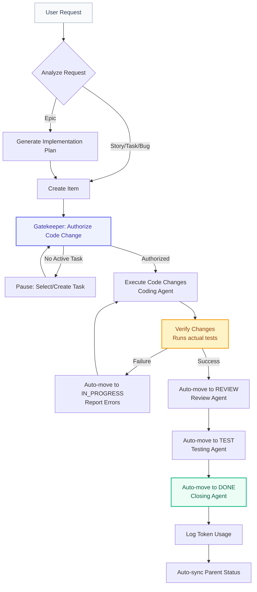

```text
                          __ _    
                         / _| |   
   __ _  __ _  ___ _ __ | |_| | __
  / _` |/ _` |/ _ \ '_ \|  _| |/ /
 | (_| | (_| |  __/ | | | | |   < 
  \__,_|\__, |\___|_| |_|_| |_|\_\
         __/ |                    
        |___/                     
```

# AgenFK: Agentic Engineering Framework

Welcome to **AgenFK**, a high-reliability, measurable, and visual framework designed to turn "Vibe Coding" into rigorous **Agentic Engineering**. AgenFK enforces a structured workflow that bridges the gap between autonomous AI agents and professional software engineering practices.

## Overview

AgenFK is built on six core mandates to ensure your AI-assisted development is consistent and high-quality:

*   **Agile**: Uses Epics, Stories, Tasks, and Bugs as first-class workflow items.
*   **Measurable**: Automatically tracks input/output tokens and models used for every single unit of work.
*   **Visual**: A real-time, hierarchical Kanban board provides instant oversight of the entire project state.
*   **Repeatable**: Uses standardized tools, prompt protocols, and context engineering to make AI behavior deterministic.
*   **Reliable**: Enforces mandatory verification (build/lint/test) before any work is declared "Done".
*   **Flexible**: Plugin-based architecture with support for MCP (Model Context Protocol), usable in Opencode, Cursor, Claude, and more.

## Installation & Setup

AgenFK installs with a single command — no cloning required:

```bash
npx github:cglab-PRIVATE/agenfk
```

This will:
*   Download the framework directly from GitHub.
*   Install all dependencies and build the full stack.
*   Configure the **MCP Server** for both **Opencode** and **Claude Code**.
*   Install the **`/agenfk`** and **`/agenfk-release`** slash commands in your AI editors.
*   Install the **Agent Skill** into Opencode.
*   Symlink the **`agenfk`** CLI to `~/.local/bin` for global access.
*   Configure the **`start:services`** Node script to launch the API and Web UI.

> **Requirements**: Node.js 18+, git, and npm. To create GitHub releases, install the [gh CLI](https://cli.github.com/).

**To update**, run the same command again — npm will fetch the latest from GitHub and re-run setup.

### Post-Install Steps

After installation, complete the setup:

1.  **Restart your AI editor** (Opencode requires a restart to pick up the new MCP server).
2.  **Start the services** in a dedicated terminal — this keeps the API and Web UI running in the background:
    ```bash
    agenfk up
    ```
    This launches the API server on `http://localhost:3000` and the Kanban UI (typically `http://localhost:5173`).
3.  **Service Lifecycle**: Manage your installation with the following commands:
    *   `agenfk upgrade`: Fetch the latest release and auto-restart services.
    *   `agenfk upgrade --beta`: Opt-in to pre-release/beta versions.
    *   `agenfk restart`: Quickly cycle both the API and UI.
    *   `agenfk down`: Stop all running AgenFK processes.
    *   `agenfk health`: Verify configuration, database, and connectivity.
    *   `npm run uninstall:framework`: Fully remove AgenFK from your system.
4.  **Initialize a project** — go to any repository and type `/agenfk` in your AI editor to link it to the framework.

## Multi-Project Support

AgenFK supports managing multiple distinct projects from a single unified backend. 

*   **Local Linking**: Each local repository is linked to a database project via a `.agenfk/project.json` file.
*   **Automatic Context Switching**: When an AI Agent (via MCP) or a developer (via CLI) starts working on a task, the API server automatically detects the project context and broadcasts an event via WebSockets.
*   **Reactive Dashboard**: The Web UI instantly and automatically switches its Kanban view to the active project being worked on, keeping the developer perfectly in sync with the agent's actions.
*   **Cross-Browser Drag & Drop**: Easily reorganize priorities with robust drag-and-drop card reordering that syncs instantly via WebSockets and optimistic UI updates.
*   **Deep Type Filtering**: Toggle view filters (e.g., "Stories Only") without losing your custom priority order across hidden items.

## Architecture Deep Dive

AgenFK utilizes a **Single Owner Architecture** to ensure data consistency and real-time reactivity. This architecture prevents "split brain" scenarios where the AI agent and the human developer are looking at different states.

*   **API Server (The Owner)**: The heart of the framework. Built with Node.js and Express. It is the exclusive manager of the `db.json` storage. It actively watches the disk for changes and broadcasts real-time updates to all connected clients via **WebSockets**.
*   **MCP Server (The Bridge)**: A lightweight Model Context Protocol client. It exposes the AgenFK tools (`create_item`, `verify_changes`, `workflow_gatekeeper`, etc.) to AI Agents. Instead of modifying the database directly, it forwards all tool invocations to the API Server via HTTP, ensuring all actions are logged and broadcasted.
*   **CLI (The Interface)**: A unified command-line tool (`./agenfk`) written in TypeScript. It allows both humans and agents to manage the backlog and framework state. Like the MCP server, it acts as a client to the API Server.
*   **Web Dashboard (The UI)**: A modern React/Vite application utilizing TanStack Query for state management. It provides a hierarchical Kanban board, token metrics, real-time progress logs (comments), detailed test results, and seamless context switching.
*   **Storage (The Memory)**: Uses an atomic, file-based JSON storage plugin by default for maximum portability. The plugin uses temporary file swapping (`fs.renameSync`) to ensure atomic writes and prevent database corruption during concurrent operations.

## Core Workflow

The framework enforces a strict sequence of operations for every task. This process is fully automated and verified by the MCP tools and global skills:



1.  **Initialize**: Generate a `.agenfk/project.json` to link the local repository to an AgenFK project. *In Opencode or Claude Code, you can simply type `/agenfk` to have the agent set this up for you.*
2.  **Analyze**: Every request is analyzed to determine if it's an Epic, Story, Task, or Bug within the current project's scope.
3.  **Plan**: Epics require a Markdown **Implementation Plan** before work begins. This ensures the AI reasons about the architecture before writing code.
4.  **Authorize**: The `workflow_gatekeeper` ensures an agent only touches code when a specific task is `IN_PROGRESS`. In Deep Mode, the gatekeeper supports multiple active tasks by verifying changes against a specific `itemId`. This prevents rogue edits.
5.  **Implementation Logging**: Agents log every significant step as a **Comment** on the card, providing a real-time audit trail in the UI.
6.  **Verify**: The `verify_changes` tool executes stack-appropriate tests (e.g., `npm test`, `pytest`) and automatically manages the transition through `REVIEW` and `TEST` statuses. The full output of these checks is permanently logged in the item's **Test Results**.
7.  **Measure**: Token consumption is logged per task and aggregated at the Story and Epic levels, providing a clear cost/velocity metric.

## Quick Start (Opencode & Claude Code)

After installation, four primary slash commands are available in your AI editor:

| Command | Description |
|---|---|
| `/agenfk` | **Standard Mode**: Execute tasks proactively in a single session. |
| `/agenfk-deep` | **Deep Mode**: Full multi-agent orchestration with planning and review gates. |
| `/agenfk-release` | Push to remote and cut a stable GitHub release. |
| `/agenfk-release-beta` | Push to remote and cut a pre-release (beta). |

Type `/agenfk` in any project to initialize the framework context. Use `/agenfk-deep` for complex features requiring maximum oversight.

## Operation Modes

AgenFK operates in two distinct modes to balance speed and rigor:

### Standard Mode (`/agenfk`)
Designed for daily engineering tasks. The primary agent acts proactively, handling implementation, verification, and closure in a single streamlined session. No mandatory pauses for simple tasks.

### Deep Mode (`/agenfk-deep`)
Designed for complex architectural changes. The primary agent acts as a **Supervisor**, enforcing a strict multi-agent lifecycle:
1.  **Plan & Pause**: Decomposes the task into sub-items and waits for your approval.
2.  **Parallel Execution**: Deep Mode supports simultaneous execution of independent tasks. The supervisor can spawn multiple sub-agents using the `task` tool to work on different components concurrently.
3.  **Autonomous Handover**: Once approved, automatically spawns specialized sub-agents for Coding, Review (Security/Logic), and Testing (80% Coverage).
4.  **Final Summary**: A Closing Agent collates all work logs into a final report before completion.

## Telemetry

AgenFK collects **anonymous usage telemetry** to help us understand how the tool is used and prioritise improvements. No personally identifiable information is ever collected.

### What is collected

| Surface | Event | When |
|---|---|---|
| Server | `server_started` | API server starts listening |
| Server | `project_created` | A new project is created |
| Server | `item_created` | A new item (Epic/Story/Task/Bug) is created |
| Server | `item_status_changed` | An item moves to a new workflow status |
| CLI | `cli_command` | Any `agenfk` command is invoked |
| CLI | `cli_db_switch` | The active database is switched |
| UI | `board_viewed` | The Kanban dashboard is opened |
| UI | `project_switched` | The user switches to a different project |
| UI | `card_opened` | A card detail modal is opened |

All events include a random, anonymous **installation ID** generated on first run and stored at `~/.agenfk/installation-id`. This ID cannot be linked to a person or machine.

### Opting out

```bash
agenfk config set telemetry false
```

This writes `"telemetry": false` to `~/.agenfk/config.json` and permanently disables all event collection.

---


---
*Built with ❤️ by the CG/lab AgenFK Platform Team.*
