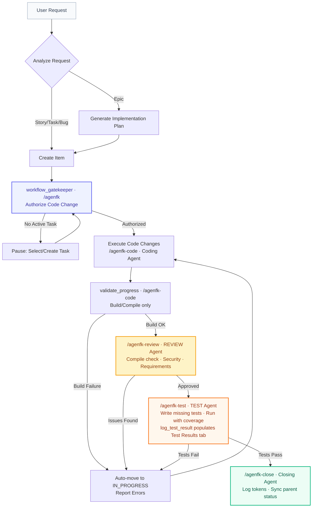

```text
                     ______           ______   _  __
     /\             |  ____|         |  ____| | |/ /
    /  \      __ _  | |__     _ __   | |__    | ' /
   / /\ \    / _` | |  __|   | '_ \  |  __|   |  <
  / ____ \  | (_| | | |____  | | | | | |      | . \
 /_/    \_\  \__, | |______| |_| |_| |_|      |_|\_\
              __/ |
             |___/
```

# AgEnFK: Agentic Engineering Framework

Welcome to **AgEnFK**, a high-reliability, measurable, and visual framework designed to turn "Vibe Coding" into rigorous **Agentic Engineering**. AgEnFK enforces a structured workflow that bridges the gap between autonomous AI agents and professional software engineering practices.

## Overview

AgEnFK is built on six core mandates to ensure your AI-assisted development is consistent and high-quality:

*   **Agile**: Uses Epics, Stories, Tasks, and Bugs as first-class workflow items.
*   **Measurable**: Automatically tracks input/output tokens and models used for every single unit of work.
*   **Visual**: A real-time, hierarchical Kanban board provides instant oversight of the entire project state.
*   **Repeatable**: Uses standardized tools, prompt protocols, and context engineering to make AI behavior deterministic.
*   **Reliable**: Enforces mandatory verification (build/lint/test) before any work is declared "Done".
*   **Flexible**: Plugin-based architecture with support for MCP (Model Context Protocol), usable across multiple AI coding agents.

## Supported Platforms

| Platform | Support Level | Enforcement | Notes |
|---|---|---|---|
| **Claude Code** | Fully Supported | PreToolUse hooks (mechanical) | Automatic blocking of workflow violations |
| **Opencode** | Fully Supported | MCP + skill integration | Native slash commands and skill system |
| **Google Gemini CLI** | Fully Supported | MCP + workflow rules | Native slash commands and skill system |
| **Cursor** | Experimental | Instructional (`.mdc` rules) | `alwaysApply: true` rule file |
| **OpenAI Codex CLI** | Fully Supported | MCP + workflow rules | Native MCP integration with installed `AGENTS.md` workflow rules |

> Cursor remains experimental because it relies on instructional rules without mechanical enforcement hooks. Codex CLI is fully supported via MCP integration and installed workflow rules.

## Installation & Setup

AgEnFK installs with a single command — no cloning required:

```bash
npx github:cglab-public/agenfk
```

This will:
*   Download the framework directly from GitHub.
*   Install all dependencies and build the full stack.
*   Configure the **MCP Server** for all detected AI coding agents (Claude Code, Opencode, Cursor, Codex CLI, Gemini CLI).
*   Install the **`/agenfk`** and **`/agenfk-release`** slash commands in your AI editors.
*   Install **workflow rules** into each platform (`CLAUDE.md`, `AGENTS.md`, `GEMINI.md`, `.mdc` for Cursor).
*   Install the **Agent Skill** into Opencode.
*   Symlink the **`agenfk`** CLI to `~/.local/bin` for global access.
*   Configure the **`start:services`** Node script to launch the API and Web UI.

> **Requirements**: Node.js 18+, git, and npm. To create GitHub releases, install the [gh CLI](https://cli.github.com/).

**To update**, run the same command again — npm will fetch the latest from GitHub and re-run setup.

### Post-Install Steps

After installation, complete the setup:

1.  **Restart your AI editor** (Opencode requires a restart to pick up the new MCP server).
2.  **Start the services** in a dedicated terminal — this keeps the API and Web UI running in the background:
    ```bash
    agenfk up
    ```
    This launches the API server on `http://localhost:3000` and the Kanban UI (typically `http://localhost:5173`).
3.  **Service Lifecycle**: Manage your installation with the following commands:
    *   `agenfk upgrade`: Fetch the latest release and auto-restart services.
    *   `agenfk upgrade --beta`: Opt-in to pre-release/beta versions.
    *   `agenfk restart`: Quickly cycle both the API and UI.
    *   `agenfk down`: Stop all running AgEnFK processes.
    *   `agenfk health`: Verify configuration, database, and connectivity.
    *   `agenfk integration list`: Show the supported editor and agent integrations.
    *   `agenfk integration install <platform>`: Reinstall one integration without rerunning the full framework installer.
    *   `agenfk integration uninstall <platform>`: Remove one integration without uninstalling the full framework.
    *   `npm run uninstall:framework`: Fully remove AgEnFK from your system.
4.  **Initialize a project** — go to any repository and type `/agenfk` in your AI editor to link it to the framework.

### Managing Individual Integrations

If you only need to repair or refresh one editor integration, use the `agenfk integration` command group instead of rerunning the full installer.

```bash
agenfk integration list
agenfk integration install claude
agenfk integration install codex --rebuild
agenfk integration uninstall cursor
```

Supported platform IDs are `claude`, `opencode`, `cursor`, `codex`, and `gemini`.

## Multi-Project Support

AgEnFK supports managing multiple distinct projects from a single unified backend. 

*   **Local Linking**: Each local repository is linked to a database project via a `.agenfk/project.json` file.
*   **Automatic Context Switching**: When an AI Agent (via MCP) or a developer (via CLI) starts working on a task, the API server automatically detects the project context and broadcasts an event via WebSockets.
*   **Reactive Dashboard**: The Web UI instantly and automatically switches its Kanban view to the active project being worked on, keeping the developer perfectly in sync with the agent's actions.
*   **Cross-Browser Drag & Drop**: Easily reorganize priorities with robust drag-and-drop card reordering that syncs instantly via WebSockets and optimistic UI updates.
*   **Deep Type Filtering**: Toggle view filters (e.g., "Stories Only") without losing your custom priority order across hidden items.

## GitHub Issues Sync

AgEnFK supports **bidirectional sync with GitHub Issues**, letting you share your Kanban cards as GitHub Issues and pull external issues back into your board.

### Prerequisites

*   [GitHub CLI (`gh`)](https://cli.github.com/) installed and authenticated (`gh auth login`).
*   A git remote pointing to a GitHub repository.

### Setup

From inside your project repository, run:

```bash
agenfk github setup
```

This auto-detects the `owner/repo` from your git remote and links it to the active AgEnFK project. The configuration is stored in `~/.agenfk/config.json`.

### Usage

#### CLI

| Command | Description |
|---|---|
| `agenfk github setup` | Link the current repo to AgEnFK for sync. |
| `agenfk github status` | Show current config, auth state, and last sync time. |
| `agenfk github sync` | Push and pull all items (default: both directions). |
| `agenfk github sync --push` | Push local items to GitHub Issues only. |
| `agenfk github sync --pull` | Pull GitHub Issues into AgEnFK only. |
| `agenfk github sync --item-id <id>` | Sync a single item by ID. |
| `agenfk github disconnect` | Remove the GitHub link for the current project. |

#### MCP Tool

AI agents can sync via the `github_sync` MCP tool:

```
github_sync(projectId, direction: "push" | "pull" | "both", itemId?)
```

#### Web UI

When GitHub sync is configured, the Kanban toolbar automatically shows:

*   **Issues** — Opens the GitHub Issues board in a new tab.
*   **Sync** — Triggers a full push + pull with a progress spinner and toast notification.
*   **Per-card links** — Cards linked to a GitHub Issue display a GitHub icon with the issue number (e.g., `#42`) that opens the issue directly.

### How It Works

*   **Outbound (Push)**: AgEnFK items are created/updated as GitHub Issues. Status maps to labels (`status:in-progress`, `status:done`, etc.) and open/closed state. Item type maps to labels (`type:bug`, `type:story`, etc.). Parent-child relationships render as markdown task lists.
*   **Inbound (Pull)**: GitHub Issues are matched by `externalId` or created as new AgEnFK items. Labels are reverse-mapped to AgEnFK statuses and types. Conflict detection uses timestamps — local wins when `updatedAt` is newer.
*   **Comments**: Synced bidirectionally with a `<!-- agenfk-sync -->` marker to prevent duplicates.

## Architecture Deep Dive

AgEnFK utilizes a **Single Owner Architecture** to ensure data consistency and real-time reactivity. This architecture prevents "split brain" scenarios where the AI agent and the human developer are looking at different states.

*   **API Server (The Owner)**: The heart of the framework. Built with Node.js and Express. It is the exclusive manager of the `db.json` storage. It actively watches the disk for changes and broadcasts real-time updates to all connected clients via **WebSockets**.
*   **MCP Server (The Bridge)**: A lightweight Model Context Protocol client. It exposes the AgEnFK tools (`create_item`, `validate_progress`, `workflow_gatekeeper`, etc.) to AI Agents. Instead of modifying the database directly, it forwards all tool invocations to the API Server via HTTP, ensuring all actions are logged and broadcasted.
*   **CLI (The Interface)**: A unified command-line tool (`./agenfk`) written in TypeScript. It allows both humans and agents to manage the backlog and framework state. Like the MCP server, it acts as a client to the API Server.
*   **Web Dashboard (The UI)**: A modern React/Vite application utilizing TanStack Query for state management. It provides a hierarchical Kanban board, token metrics, real-time progress logs (comments), detailed test results, and seamless context switching.
*   **Storage (The Memory)**: Uses an atomic, file-based JSON storage plugin by default for maximum portability. The plugin uses temporary file swapping (`fs.renameSync`) to ensure atomic writes and prevent database corruption during concurrent operations.

## Core Workflow

The framework enforces a strict sequence of operations for every task. This process is fully automated and verified by the MCP tools and global skills:



1.  **Initialize**: Generate a `.agenfk/project.json` to link the local repository to an AgEnFK project. *In Opencode, Claude Code or Gemini, you can simply type `/agenfk` to have the agent set this up for you.*
2.  **Analyze**: Every request is analyzed to determine if it's an Epic, Story, Task, or Bug within the current project's scope.
3.  **Plan**: Epics require a Markdown **Implementation Plan** before work begins. This ensures the AI reasons about the architecture before writing code.
4.  **Authorize**: The `workflow_gatekeeper` ensures an agent only touches code when a specific task is `IN_PROGRESS`. In Deep Mode, the gatekeeper supports multiple active tasks by verifying changes against a specific `itemId`. This prevents rogue edits.
5.  **Implementation Logging**: Agents log every significant step as a **Comment** on the card, providing a real-time audit trail in the UI.
6.  **Build Verify**: `validate_progress` runs a **build/compile command** to gate each intermediate step transition. The agent picks the command. On the final step, the project's `verifyCommand` is enforced (agent cannot override).
7.  **Review**: The Review Agent checks compilation, security vulnerabilities, and requirements traceability. If issues are found, the item returns to `IN_PROGRESS`.
8.  **Test**: The Testing Agent writes any missing tests, runs the full suite with coverage, and records results with `log_test_result` — populating the **Test Results** tab on the card. Coverage must meet the 80% threshold.
9.  **Measure**: Token consumption is logged per task and aggregated at the Story and Epic levels, providing a clear cost/velocity metric.

## Custom Workflow Flows

AgEnFK v0.2 ships with **Custom Workflow Flows** — one of the most requested features since launch.

You are no longer locked into the built-in TODO → IN_PROGRESS → REVIEW → TEST → DONE pipeline. Flows let you define exactly how work moves through your team: name the steps, write exit criteria for each one, and AgEnFK enforces them end-to-end — for both humans and AI agents.

### How Flows Work

A **Flow** is an ordered list of steps with a name and exit criteria per step. Two anchors are always present and cannot be removed:
- **TODO** — the entry point for all new work.
- **DONE** — the terminal state. The project's `verifyCommand` is enforced here by `validate_progress`.

Everything in between is yours to define. A QA-heavy team might use `TODO → DEV → QA → SIGN_OFF → DONE`. A solo developer might keep it minimal: `TODO → CODING → DONE`.

### Flow Editor

Open the **Flow Editor** from the Kanban toolbar to manage your flows visually:

- **Create** a new flow from scratch or **clone** an existing one as a starting point.
- **Drag to reorder** steps and edit the name and exit criteria inline.
- **Set as active** to switch your project to that flow — cards are automatically migrated to the nearest equivalent step.
- **Use Default Flow** to revert to the built-in AgEnFK workflow at any time.

The Kanban board columns update instantly to reflect the active flow.

### Agent Integration

Agents load the full flow at session start using the `get_flow` MCP tool:

```
get_flow(projectId) → { steps: [{ name, exitCriteria }] }
```

Every call to `validate_progress` is flow-aware. The agent must provide `evidence` describing how it satisfied the **current step's exit criteria**. On success, the response includes the **next step's exit criteria** as mandatory work instructions for the agent.

```
validate_progress(itemId, evidence, command?) → { nextStep, exitCriteria }
```

### Community Registry

Flows can be shared, discovered, and installed from the **AgEnFK Community Registry** ([cglab-public/agenfk-flows](https://github.com/cglab-public/agenfk-flows)).

**Browse & Install** — from the Flow Editor, open the Community tab to search flows by name or author and install with one click.

**Publish** — share your flow with the community directly from the editor:
- If you are the registry owner, your flow is pushed straight to `main`.
- Otherwise, AgEnFK forks the registry via `gh`, pushes your flow to a branch, and opens a PR — no token configuration needed.

**CLI commands:**

```bash
agenfk flow browse               # Search the community registry
agenfk flow install <name>       # Install a flow by name
agenfk flow publish              # Publish the active flow to the registry
```

---

## Quick Start

After installation, slash commands are available in your AI editor (Claude Code, Opencode, Gemini and other supported platforms):

| Command | Description |
|---|---|
| `/agenfk` | **Standard Mode**: Execute tasks proactively in a single session. |
| `/agenfk-deep` | **Deep Mode**: Full multi-agent orchestration with planning and review gates. |
| `/agenfk-release` | Push to remote and cut a stable GitHub release. |
| `/agenfk-release-beta` | Push to remote and cut a pre-release (beta). |

Type `/agenfk` in any project to initialize the framework context. Use `/agenfk-deep` for complex features requiring maximum oversight. On experimental platforms (Cursor), the MCP tools are available directly — refer to the platform-specific workflow rules installed during setup.

## Operation Modes

AgEnFK operates in two distinct modes to balance speed and rigor:

### Standard Mode (`/agenfk`)
Designed for daily engineering tasks. The primary agent acts proactively, handling implementation, verification, and closure in a single streamlined session. No mandatory pauses for simple tasks.

### Deep Mode (`/agenfk-deep`)
Designed for complex architectural changes. The primary agent acts as a **Supervisor**, enforcing a strict multi-agent lifecycle:
1.  **Plan & Pause**: Decomposes the task into sub-items and waits for your approval.
2.  **Parallel Execution**: Deep Mode supports simultaneous execution of independent tasks. The supervisor can spawn multiple sub-agents using the `task` tool to work on different components concurrently.
3.  **Autonomous Handover**: Once approved, automatically spawns specialized sub-agents for Coding, Review (Security/Logic), and Testing (80% Coverage).
4.  **Final Summary**: A Closing Agent collates all work logs into a final report before completion.

## Telemetry

AgEnFK collects **anonymous usage telemetry** to help us understand how the tool is used and prioritise improvements. No personally identifiable information is ever collected.

### What is collected

| Surface | Event | When |
|---|---|---|
| Server | `server_started` | API server starts listening |
| Server | `project_created` | A new project is created |
| Server | `item_created` | A new item (Epic/Story/Task/Bug) is created |
| Server | `item_status_changed` | An item moves to a new workflow status |
| CLI | `cli_command` | Any `agenfk` command is invoked |
| CLI | `cli_db_switch` | The active database is switched |
| UI | `board_viewed` | The Kanban dashboard is opened |
| UI | `project_switched` | The user switches to a different project |
| UI | `card_opened` | A card detail modal is opened |

All events include a random, anonymous **installation ID** generated on first run and stored at `~/.agenfk/installation-id`. This ID cannot be linked to a person or machine.

### Opting out

```bash
agenfk config set telemetry false
```

This writes `"telemetry": false` to `~/.agenfk/config.json` and permanently disables all event collection.

---

## FAQ

### Does AgEnFK substitute agile management tools such as JIRA, Monday, ClickUp, etc.?

No — and it is not meant to. AgEnFK operates at a completely different level of granularity.

Tools like JIRA, Monday, or ClickUp manage work at the **team and product level**: sprints, epics, roadmaps, cross-team dependencies, stakeholder visibility. They answer questions like *"What is the team shipping this quarter?"* and *"Is this feature on track?"*

AgEnFK operates **inside** a single developer's workflow, specifically within the steps those tools mark as *"In Progress"*, *"Developing"*, or *"In Development"*. It answers a different question: *"How is the AI agent executing this specific task — and is it doing so correctly?"*

Think of it as the developer's own, customisable, **Agentic Engineering flow automation and enforcement tool**. When a ticket moves to *In Progress* in JIRA, that is where AgEnFK takes over — decomposing the work into granular steps, enforcing a TDD or custom flow, gating transitions with build/test verification, and producing a measurable audit trail of exactly what the AI agent did and why. When the work is done, AgEnFK closes its sub-workflow and the parent ticket advances in JIRA as normal.

In short: **JIRA manages the sprint. AgEnFK manages the agent.**

---

### Does AgEnFK work with any AI coding platform?

AgEnFK supports Claude Code (fully, with mechanical enforcement via PreToolUse hooks), Opencode, Google Gemini CLI, and OpenAI Codex CLI (all fully supported via MCP + workflow rules), and Cursor (experimental, via instructional `.mdc` rules). See the [Supported Platforms](#supported-platforms) table for details.

---

### Do I need an internet connection?

No. AgEnFK runs entirely on your local machine — the API server, Kanban UI, and database are all local. An internet connection is only needed for `agenfk upgrade` (fetching a new release from GitHub) and optional telemetry (which can be disabled).

---

### What happens if the AgEnFK server is not running?

The AI agent will be unable to call MCP tools (`create_item`, `validate_progress`, etc.) and the workflow gatekeeper will block edits. Run `agenfk up` to start the services before beginning a session.

---

### Can I use AgEnFK across multiple projects?

Yes. Projects are independent records in the database. You can switch between them freely — the Kanban board shows all projects, and the CLI and MCP tools all accept a `--project` flag or read from a local `.agenfk/project.json` file.

---

### Is my code or project data sent anywhere?

No. Your source code and project data never leave your machine. The only outbound data is anonymous usage telemetry (see [Telemetry](#telemetry)), which can be disabled with `agenfk config set telemetry false`.

---


---
*Built with ❤️ by the CG/lab AgEnFK Platform Team.*
