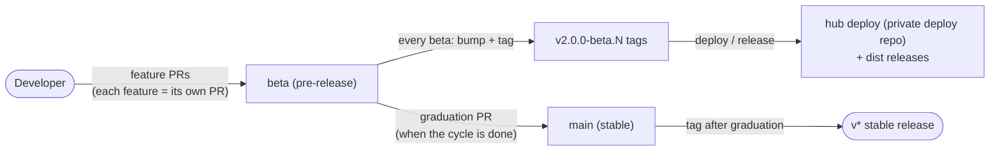

# Releasing AgEnFK: `beta` and `main`

This repo ships through two channels backed by two branches:



| | `main` | `beta` |
|---|---|---|
| Channel | Stable | Pre-release |
| What ships from it | `v*` tags (full framework dist) | `v2.0.0-beta.N` tags (framework dist) + hub Docker image |
| Who runs it | End users on stable | The production hub (via the private deploy repo) and anyone on `--beta` |
| PRs that target it | Dependabot/security bumps that must reach stable fast, hotfixes | Every feature, fix and dependency bump by default |
| Protected by | CI on PRs | CI on PRs (pushes are kept green the same way) |

## The model in one paragraph

`beta` is a **branch from `main`** that acts as the standing pre-release line. Feature
work merges into `beta` as individual PRs; every so often a beta
(`v2.0.0-beta.N`) is tagged from it and the hub is deployed from that tag. When the
line has accumulated enough and is green, a **graduation PR** (`beta` → `main`)
ships the whole cycle to stable; `main` is tagged, and `beta` is reset from `main`
for the next cycle. Nothing unstable ever lands directly on `main`.

## Flows

### 1. Feature → beta

```bash
git checkout beta && git pull                     # or branch from origin/beta
git checkout -b fix/CGLAB-NNN_short-description
# ...work...
git push -u origin fix/CGLAB-NNN_short-description
gh pr create --base beta                          # NOT main
```

- Cards' branch names follow the JIRA key (`feat/` / `fix/` prefix by item type).
- PRs into `beta` get full CI; merge when green.

### 2. Cutting a beta (from the `beta` branch)

```bash
git checkout beta && git pull
node scripts/bump-version.mjs 2.0.0-beta.<N+1>   # next beta number
npm install --package-lock-only                   # lockfile must move with the manifest
git add package.json package-lock.json packages/*/package.json
git commit -m "chore: bump version to 2.0.0-beta.<N+1>"
```

- **CHANGELOG entry is mandatory**: a `hub-docs-tenancy` test fails the build if the
  current version has no `CHANGELOG.md` entry. Add one before or with the bump commit.
- Package and verify the distributable: `node scripts/package-dist.mjs`, then check
  the tarball carries no macOS metadata (see `.claude/commands/agenfk-release-beta.md`
  for the check command — never trust `tar -tzf` on macOS).
- Tag and push: `git tag v2.0.0-beta.<N+1> && git push origin HEAD --tags`.
- Create the GitHub pre-release with the tarball attached.

### 3. Deploying the hub

The hub ships from the **private hub deploy repo** (infra + CI only; not in this public repo).
Its `deploy.yml` (workflow_dispatch) builds the hub image from an explicit `agenfk_ref`
and rolls ECS:

```bash
gh workflow run deploy.yml --repo <private-hub-deploy-repo> \
  --ref main -f agenfk_ref=v2.0.0-beta.<N>
```

There is **no default ref on purpose** — a silent fallback once rolled production
back to a stale tag. Always pass the tag/SHA you mean to deploy, and watch the run
to `completed success`.

A `hub-v*` tag pushed in the main repo instead builds the hub image via
`hub-image.yml` — that is the *between-releases* path; the normal cadence is the
deploy repo above, pointed at the beta tag you just cut.

### 4. Graduating to stable (`beta` → `main`)

When the cycle is done and CI is green:

1. Open a **graduation PR: `base = main`, `head = beta`** (one PR per cycle).
2. Merge it; tag stable from `main` (`/agenfk-release` flow: bump, tag, release).
3. **Reset the line**: `beta` is fast-forwarded/reset to `main` and the next cycle
   begins. Feature branches still in flight rebase onto the new `beta`.

Do not let the graduation slip for too long — the longer `beta` and `main` diverge,
the riskier the merge (the beta.31 "two beta lines rejoined" mess is the cautionary
tale in the CHANGELOG).

### 5. Hotfixes

- Needed on stable now: PR into `main`, release, **then cherry-pick the commit back
  onto `beta`** (or PR it into both) so the lines reconverge.
- Needed only on the beta line: normal feature PR into `beta`, cut a beta.

## Rules of the road

- **Never release from a feature branch.** The beta line is `beta`; feature branches
  are for review, not for tagging. (This is why the old
  `feat/CGLAB-164_electron-desktop` carrier was retired — see PR #194.)
- **The lockfile moves with the version bump, always in the same commit.**
- **A version bump without a CHANGELOG entry does not build** — the docs-tenancy
  test enforces it.
- **The hub deploy ref is always explicit.** If you cannot name the exact tag or
  SHA going to production, stop and find out.
- **`main` only ever changes via the graduation PR** (plus cherry-picked hotfixes).
  Dependabot PRs default to `main`; if a bump should ride the beta line, re-point
  the PR's base to `beta`.

## History

- PR #194 carried the beta line as a feature branch (`feat/CGLAB-164_electron-desktop`)
  from `v1.1.21-beta.3` through `v2.0.0-beta.33`. It was closed once the dedicated
  `beta` branch took over; the changelog's beta.31 entry documents why one carrier
  branch per release got unwieldy.
